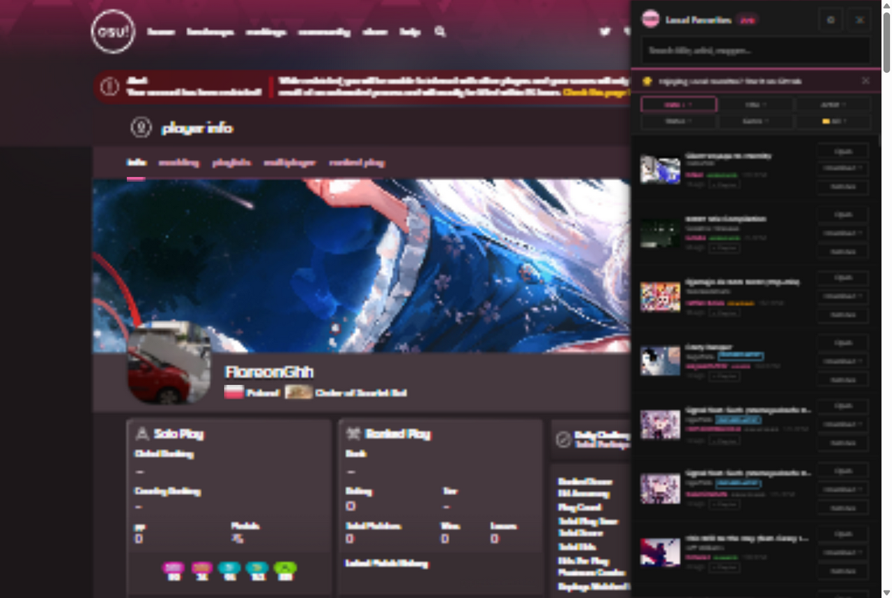
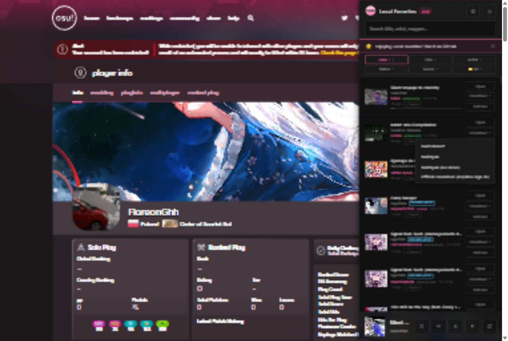
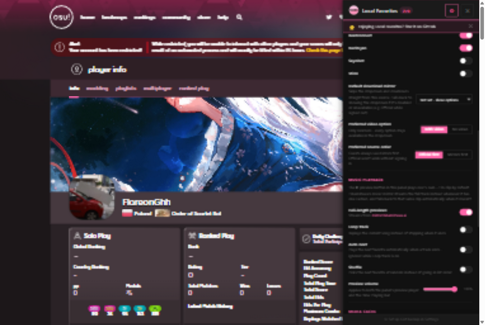
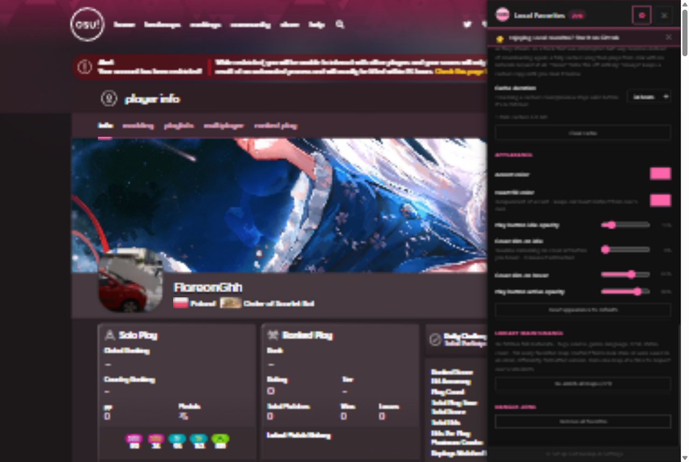
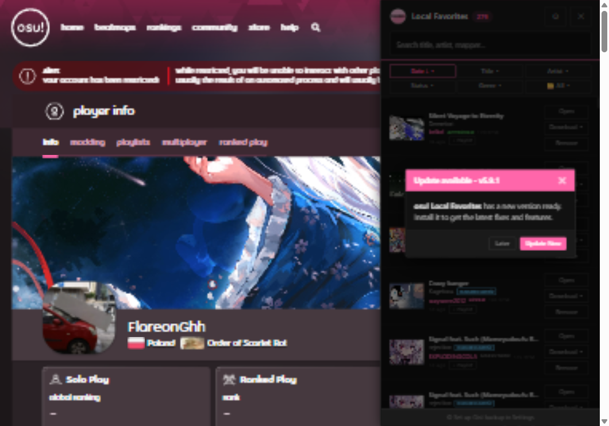

# osu! Local Favorites

Store osu! beatmap favorites locally in your browser. No server-side limits, no account needed - with optional GitHub Gist backup if you want your list to follow you across devices.

## What it does

Replaces the default "Favorite" button on [osu.ppy.sh](https://osu.ppy.sh) with local browser storage. Your favorites stay on your machine (or your own private Gist, if you choose to back them up).

## How to install

### Tampermonkey Userscript

1. Install [Tampermonkey](https://www.tampermonkey.net/)
2. **[Click here to install](https://github.com/starhollow2008/Local-osu-favorites/raw/refs/heads/main/dist/osu-local-favorites.user.js)** - Tampermonkey will open the installation page automatically.

The script adds a **View Local Favorites** option in the Tampermonkey menu. Click it to open a side panel with all your favorites.

### Firefox for Android media controls

For a duration, seek timeline, and playback progress in Android's system media notification or lock screen, use **Firefox for Android 156 or newer**. Older Firefox Android releases expose track artwork and play/pause controls but do not pass a web page's Media Session position state through to Android, so the system player shows `00:00 — 00:00`. Mozilla enabled the timeline support in Firefox 156 ([bug 2063332](https://bugzilla.mozilla.org/show_bug.cgi?id=2063332)).

### Browser Extensions

> **Heavily deprecated browser extension** 
this is behind by about 2.0.3 major releases [122 commits behind check here](https://github.com/starhollow2008/Local-osu-favorites/compare/v3.4.2...main)
> The old browser-extension build (`manifest.json`, `content.js`, `popup.*`, `background.js`, etc.) is no longer maintained or included in this repository - only the archived v3.4.2 release below still has those files. All active development happens on the Tampermonkey userscript.

1. Download `osu-favorites-extension.zip` or `osu-favorites-extension.xpi` from the [last extension release](https://github.com/starhollow2008/Local-osu-favorites/releases/tag/v3.4.2)
2. Unzip
3. Go to `chrome://extensions/`, enable Developer mode
4. Click **Load unpacked** and select the unzipped folder

For Firefox
1. Download `osu-favorites-extension.xpi` from the [last extension release](https://github.com/starhollow2008/Local-osu-favorites/releases/tag/v3.4.2) (.xpi file)
2. To install it in Firefox go to `about:debugging` → `This Firefox` → `Load Temporary Add-on` → pick the .xpi file*(temporary - it will be removed after browser restart)*

### Or clone the repo and load it directly
```bash
git clone https://github.com/starhollow2008/Local-osu-favorites.git
```

Then load the folder in `chrome://extensions/`.

### Build manually

The Tampermonkey userscript is generated from the modules under `src/`, so edit
those - never `dist/osu-local-favorites.user.js`, which is overwritten on every
build. There are no dependencies; plain Node is enough.

```bash
git clone https://github.com/starhollow2008/Local-osu-favorites.git
cd Local-osu-favorites
node build/build.js
```

| command | what it does |
| --- | --- |
| `node build/build.js` | checks the wiring, then bundles `src/` into `dist/` |
| `node build/build.js --check` | check only, writes nothing |
| `node build/build.js --check --strict` | same, but heuristic warnings also fail the build |

A successful build writes two files:

| file | what it is |
| --- | --- |
| `dist/osu-local-favorites.user.js` | the userscript users install - plain code, no comments |
| `dist/comments.md` | every comment that was removed, linked to the line it came from |

To try an unreleased build, open `dist/osu-local-favorites.user.js` in
Tampermonkey (or drag it onto the extensions page) after running the build.

Adding a module is four steps: create the file under the right `src/` folder,
`export` what other modules need and `import` what you use, add it to `order`
in `build/modules.json` (so anything it reads at load time comes earlier), then
re-run `node build/build.js`.

## Side Panel Demo

Search, sort, preview, and download every favorite without leaving the panel - including per-map access to any download mirrors you've enabled.

| Side panel | Inline preview & download mirrors |
| :---: | :---: |
|  |  |

### Settings

Everything below lives behind the ⚙ **Settings** button in the side panel header, shown here in three
scroll positions:

<table>
  <tr>
    <td width="33%" valign="top"></td>
    <td width="33%" valign="top"></td>
    <td width="33%" valign="top"></td>
  </tr>
</table>

- **Backup & Restore** - export your whole library to a JSON file, or import one back in (merges, skips duplicates)
- **GitHub Gist Backup** - connect a GitHub account (personal access token, `gist` scope) and back your favorites up to a Gist:
  - **Manual or Auto** - flip a switch to have every new/removed favorite pushed automatically, or trigger backups yourself with **Backup now**
  - **Private or Public** - choose the Gist's visibility (GitHub doesn't allow changing this after creation, so switching creates a fresh Gist)
  - **Restore from Gist** - pull a backup down on a new device/browser; reconnecting also auto-detects an existing backup Gist so you don't end up with duplicates
  - **Fetch from Gist** - pull from any gist by pasting its ID or URL, without changing what **Backup now** targets. Useful on a new device before your first backup, or for grabbing someone else's shared favorites list
  - A small status line in the panel footer always shows whether you're connected and when you last synced
- **Download Mirrors** - osu!'s own download link requires a real logged-in session (it 404s for guests no matter what), and some maps have downloads disabled outright. Toggle third-party mirrors - Beatconnect, NeriNyan, Sayobot, Mino - and they'll show up in the panel's **Download** button and as extra buttons on the beatmap page itself, styled to match osu!'s own download buttons exactly. Two more controls decide ordering (nothing is ever hidden, just reordered): **Preferred video option** (with video vs. no video first) and **Preferred source order** (official vs. mirrors first - guests always see mirrors first regardless, since Official won't work without signing in). If osu!plus is already injecting its own mirror buttons on a page, ours steps aside to avoid a duplicate row
- **Appearance** - pick your own accent color (replaces the default pink everywhere: buttons, badges, toggles, the header bar), a separate **Heart fill color** for the favorite icon itself (independent of accent, so it stays visually distinct from osu!'s own heart), and four sliders for the cover-art play button and its dim overlay: idle opacity, idle dim, hover dim, and active opacity
- **Library Maintenance** - a **Re-enrich all maps** button that re-fetches full metadata (tags, source, genre, language, BPM, status, cover) for every favorite from osu! itself. Useful after a data-format change, or if some fields look stale or were saved in an older/differently-cased format. Runs one map at a time (rate-limited) with a live progress bar, and can be cancelled mid-run
- **Danger Zone** - remove all favorites, with a two-click confirmation

## The heart on a beatmap

| Normally | On a favorited beatmap |
| :---: | :---: |
|  |  |

## Automatic updates

The script checks GitHub for a newer version and offers the update in two places - a prompt in the
corner of the page, and an overlay inside the panel when you next open it.

| Page-level prompt | In-panel prompt |
| :---: | :---: |
|  |  |

*The version number in these screenshots is whatever the current release is, not necessarily what is
shown here.*

## How it works

- Intercepts favorite button clicks on beatmap pages and listing pages
- Blocks osu!'s server-side favorite API calls (and the login redirect they'd otherwise trigger)
- Stores favorites locally via `GM_setValue`/`GM_getValue`, with an optional encrypted-in-transit backup to a GitHub Gist
- Floating heart button in the bottom-right corner of every osu! page
- A side panel (☰ from the floating heart, or **View Local Favorites** in the Tampermonkey menu) to browse, search, sort, play previews, download, and manage everything
- Periodically checks GitHub for a newer script version and shows a prompt when one's available
- Its accent(glow) and colour of the heart itself can be changed by accent and heart border/fill color

## Features

- Favorite beatmaps from detail pages or listing cards, without needing to sign in
- Search and sort favorites in the side panel (by date added, title, artist, or status)
- Inline audio previews with a progress bar, right on each card
- One-click **Open** and **Download** per map (official + any mirrors you've enabled), alongside **Remove**
- Guest download links unlocked on beatmap pages and listing cards (with & without video)
- Bulk-import your real osu! account favorites via the "Favorite all" button on a profile page
- Robust against fast scrolling and osu!'s own lazy-loaded content - a periodic background scan keeps heart states, download links, and injected buttons in sync even when a card renders between checks

## Files

| File | Purpose |
|------|---------|
| `dist/osu-local-favorites.user.js` | The Tampermonkey userscript - this *is* the extension (generated, do not edit) |
| `src/` | The modules the userscript is built from |
| `build/` | The bundler and its five build gates |
| `icons/` | Icons used in the panel header and browser toolbar |
| `screenshots/` | Images used in this README |
| `LICENSE` | MIT license |

## Limitations

- Purely local by default - favorites don't sync between devices unless you export/import or connect GitHub Gist backup
- Gist backup requires a GitHub personal access token with `gist` scope, stored locally by Tampermonkey - treat it like any other credential
- Download mirrors (Beatconnect, NeriNyan, Sayobot, Mino) are third-party services, not affiliated with or endorsed by osu! - they're off by default except Beatconnect and NeriNyan; enable/disable them in Settings
- Only works on `osu.ppy.sh`, and only where osu! itself shows a favorite heart (beatmap pages, listing cards, and profile sections)
- May need updates if osu! changes their page layout

## License

[MIT](https://github.com/starhollow2008/Local-osu-favorites/blob/main/LICENSE)
